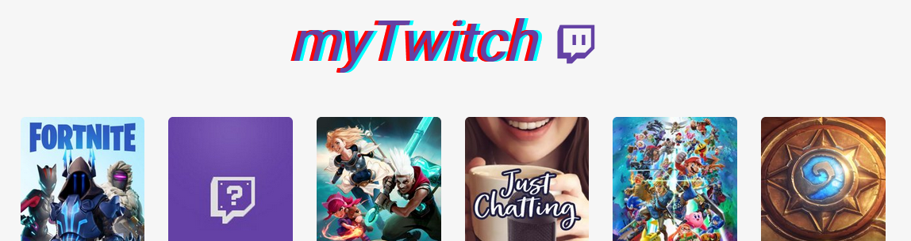

### JavaScript Twitch API "thing"
------------
A small Sunday project, it is basically a twitch web app. When loaded it will show you the 20 most popular games. If you click on one of them you'll get an overview who is streaming them right now => select a streamer and it will show you the stream (embedded). So all in all nothing special.

**files will follow**

**Features:**
- VanillaJS
- Uses the "[New Twitch API](https://dev.twitch.tv/docs/api)"
- Lots of bugs and missing features!

**Libraries:**
- [Bootswatch](http://bootswatch.com)
- [FontAwesome](http://fontawesome.com)
- [Google Fonts](https://fonts.google.com)

